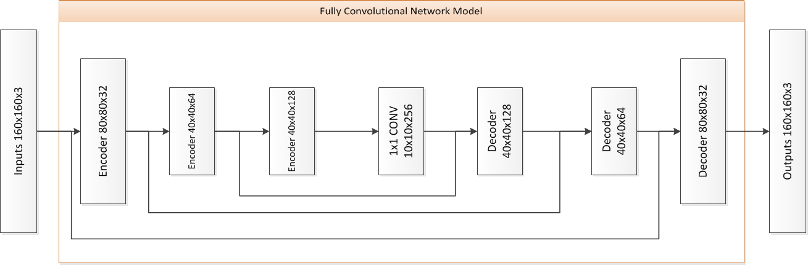

# Writeup for Udacity Project "Follow Me"

## What to include in the submission

The submission must include these items:

1. The ```model_training.ipynb``` notebook that you have filled out.
2. A HTML version of the ```model_training.ipynb``` notebook.
3. This writeup report (as md or pdf file)
4. The model and weights file in the ```.h5``` file format

Also the submission must fullfill the following 
1. 


The neural network should obtain an accuracy greater than or equal to 40% (0.40) using the Intersection over Union (IoU) metric.

## Network architecture

The architecture of the network is based on a Fully Convolutional Network (FCN).
One of the main advantages of the FCN is the ability to retain spatial information.
The FCN is made up of three blocks:

1. Encoder Block
2. 1x1 Convolution Block
3. Decoder Block

In this solution, two encoder/decoder blocks were used. This leads to the follwoing architecture:


### Encoder Block

The encoder extracts the main features from an image whereas the decoder maps them to the original image. Each layer of the encoder used in this project consists of a separable convolutional layer and a batch normalization with an activation function included. The decoder consists of a bilinear upsampling layer, a concatenation layer and a separable convolutional layer.

Each layer of the encoder has a clear function. The separable convolutional layer reduces the number of parameters of the network and identifies the main features (extracts spatial information). The batch normalization layer, as the name implies, normalizes the inputs to each layer within the network to have a well conditioned problem. The activation function (a RELU in this case) adds non-linearities to the network for it to better fit the model.

```python
def encoder_block(input_layer, filters, strides):
    # Create a separable convolution layer using the separable_conv2d_batchnorm() function.
    output_layer = separable_conv2d_batchnorm(input_layer, filters, strides)
    return output_layer
```

### Decoder Block

On the decoder side, the bilinear upsampling layer expands the dimensions of the encoded information (the objective is to reach the size of the original image). The concatenation layer is similar to skipping the connections, which is a technique that allows one layer to use information from different resolution scales (from layers prior to the preceding one). Finally, the last piece of each decoder layer is another separable convolutional layer.

```python
def decoder_block(small_ip_layer, large_ip_layer, filters):
    # Upsample the small input layer using the bilinear_upsample() function.
    small_ip_layer_upsampled = bilinear_upsample(small_ip_layer)
    # Concatenate the upsampled and large input layers using layers.concatenate
    output_layer = layers.concatenate([small_ip_layer_upsampled, large_ip_layer])
    # Add some number of separable convolution layers
    output_layer = separable_conv2d_batchnorm(output_layer, filters)
    return output_layer
```

### 1x1 Convolution Block

Between the decoder and the encoder, there is a 1x1 convolution layer that increases the depth of the network while preserving spatial information. This is very common for object detection and semantic segmentation. Additionally, it has the advantage that during inference we can feed images of any size into the trained network. The alternative would be a fully-connected layer, which keeps the number of features but needs a fixed image size.

### Model

```python
def fcn_model(inputs, num_classes):
    filters_1 = 32
    filters_2 = 64
    filters_3 = 128
    strides = 2
    # Add Encoder Blocks.
    # Remember that with each encoder layer, the depth of your model (the number of filters) increases.
    encoded_1 = encoder_block(inputs, filters_1, strides)
    encoded_2 = encoder_block(encoded_1, filters_2, strides)
    # Add 1x1 Convolution layer using conv2d_batchnorm().
    one_by_one = conv2d_batchnorm(input_layer=encoded_2,  filters=filters_3, kernel_size=1, strides=1)
    # Add the same number of Decoder Blocks as the number of Encoder Blocks
    decoded_1 = decoder_block(small_ip_layer=one_by_one, large_ip_layer=encoded_1, filters=filters_2)
    decoded_2 = decoder_block(small_ip_layer=decoded_1, large_ip_layer=inputs, filters=filters_1)
    # The function returns the output layer of your model, which is the final layer obtained from the last decoder_block()
    return layers.Conv2D(num_classes, 3, activation='softmax', padding='same')(decoded_2)
```

## Hyper Parameters

The hyper parameters for the FCN are defined as follows:

* __batch_size:__  
  number of training samples/images that get propagated through the network in a single pass.
* __num_epochs:__  
  number of times the entire training dataset gets propagated through the network.
* __steps_per_epoch:__  
  number of batches of training images that go through the network in 1 epoch.
* __validation_steps:__  
  number of batches of validation images that go through the network in 1 epoch. This is similar to steps_per_epoch, except validation_steps is for the validation dataset. 
* __workers:__  
  maximum number of processes to spin up. This can affect the training speed and is dependent on the hardware. 

Additionally 

From the segmentation lab the following parameter sets were used:

| run | # encoders/decoders| filter(s) |  learning rate | batch size | # epochs | steps per epoch | validation steps | workers |
| ----- | ---- | ------ | ---- | ------------------ | --- | --- | --- | --- |
| run1  | 1    | 20     | 0.05               | 50  | 10  | 200 | 50  | 2  |
| run2  | 1    | 20     | 0.05               | 50  | 20  | 200 | 50  | 2  |
| run3  | 1    | 20     | 0.05               | 100 | 20  | 200 | 50  | 2  |
| run4  | 1    | 20     | 0.05               | 100 | 50  | 200 | 50  | 2  |
| run5  | 2    | 20/40  | 0.05               | 100 | 50  | 200 | 50  | 2  |

And for these runs the following results have been collected:

| run  | average IoU for background | average IoU for other people | average IoU for hero | global average IoU |  
| ---- | ----               | ------------------  | ---                  | ---                 |
| run1 | 0.9828951983470107 | 0.10618387638037707 | 0.044549251198274686 | 0.37787610864188753 |
| run2 | 0.9803128523368182 | 0.17413905069974045 | 0.11007914667321698  | 0.4215103499032586  |
| run3 | 0.9853443167216672 | 0.13480468831835557 | 0.10498744888605738  | 0.4083788179753601  |
| run4 | 0.9821987577085073 | 0.1917738857966337  | 0.12318991573151504  | 0.432387519745552   |
| run5 | 0.9904808576661485 | 0.27309245560181955 | 0.1393159806112834   | 0.46762976462641714 |


The intersection over union (IoU) is commonly used to messure the performance of a model on the segmentic segmentation task.

intersection set / union set


stride:
The amount by which the filter slides is referred to as the 'stride'. The stride is a hyperparameter which you, the engineer, can tune. Increasing the stride reduces the size of your model by reducing the number of total patches each layer observes. However, this usually comes with a reduction in accuracy.

### Various follow-me scenarios

The network is currently based on the standard architecture, so there shouldn't be any big changes. Regarding to reuse it for other "follow me" scenarios, we would need to train it with the corresponding dataset and evaluate the new hyper parameters, like we did here.

## Future Enhancements

1. Collect more data to train the model. This could easily be done by investing more time.
2. Optimize the hyper parameters. Instead of guessing and running each step by
   hand, we could use an evolutionary algorithm to optimize the parameters for us. Since we already have the parameters and our fitness value (IoU), 
